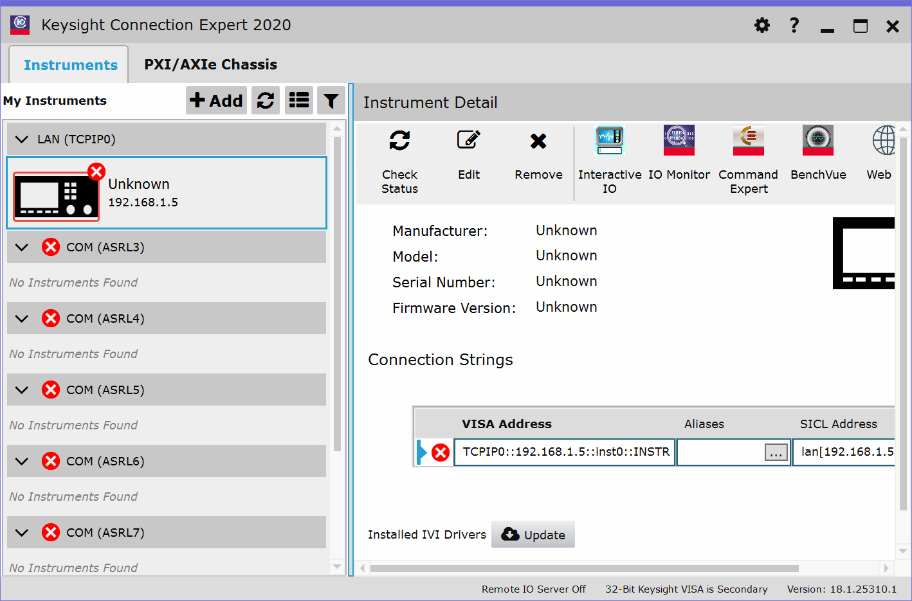
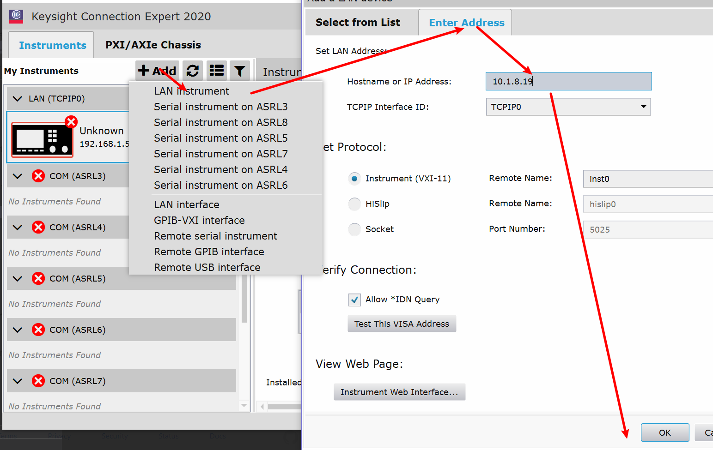
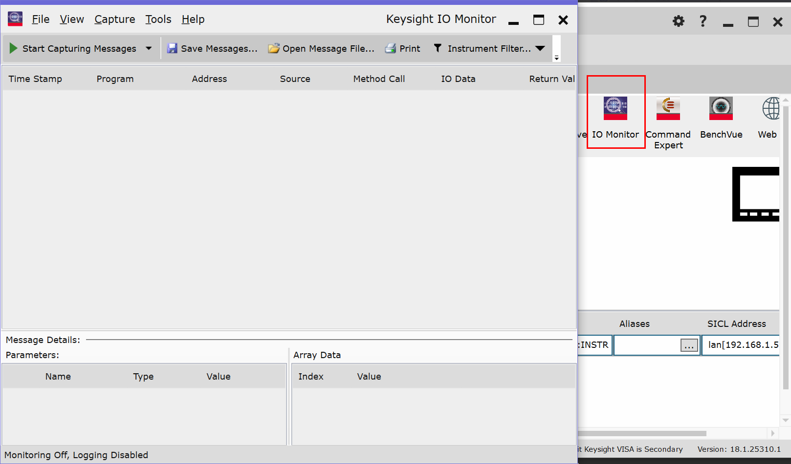

# VXI_Control_Matlab

**未完待续**

# 背景
鉴于实验室目前存在的代码控制各种仪器的需求，对目前Matlab控制设备仪表的代码进行了封装和整理。

**Keysight(是德科技)**, **Aglient(安捷伦)**, **Rohde & Schwarz(罗德施瓦茨)**, **Tektronix(泰克)**,**Anritsu(安立)** 等公司的仪器均采用IVI驱动的标准编写了对应的接口，所以我们可以很容易的来控制对应的仪器。所以本代码库也只是简单的将之前我遇到过的仪器时，封装过的代码库进行整理

# 准备工作 
## 驱动安装
### 驱动下载
不同厂商都提供了对应的控制驱动，包括Keysight的IO控件，Tektronix的TekVisa等等，就目前的使用经历来看，Keysight的驱动使用最方便，由因为所有的驱动采用相同的标准，所以我们只需要安装一个合适的驱动即可

PS： Keysight的官网也是以上仪器厂商质量最高，用户手册和编程手册写的最清晰的。

我们可以在
[IO 程序库套件下载](https://www.keysight.com/cn/zh_cn/lib/software-detail/computer-software/io-libraries-suite-downloads-2175637.html)
选择需要的版本下载。

或者这个链接下载
[Keysight IO Libraries Suite 2021](https://download.keysight.com/AS/IOLibraries/windows/IOLibSuite_18_2_26526.exe?dl=1&authparam=1626859448_73f7f6aa5a51414261c157718ac2cb9f)

> 顺便可以下载Keysight对应的程序例子：[IO Libraries Suite Example Programs](https://www.keysight.com/us/en/assets/9018-21729/programming-examples/IO_Example_Programs_October_19_2016.zip)

### 添加设备
因为不同的驱动添加设备的方法不一致，所以仅提供Keysight IO控件的说明
1. 安装好IO控件后，界面如下：

2. 一般我们通过网线链接我们的设备与计算机，所以一般选择LAN，当然其他链接方式可以自行配置，使用网线链接需要注意**仪器与计算机应该在一个网段下边**

### Command Expert
这个是IO控件根据实际链接的仪器，自动搜索对应驱动，然后查找控制函数的工具，如果灵活运用，其功能非常强大：
包括：
- 搜索需要的控制控制函数，完整的帮助
- 根据对应命令，生成控制序列
- 根据生成的控制序列，导出为Matlab，C#,VB，C++等代码

### IO Monitor
这个主要配合Command Expert使用。可以监控：

### 驱动下载
## tmtool
# 代码说明

# 参考资料
编写控制代码
## Keysight & Aglient

## 工具说明