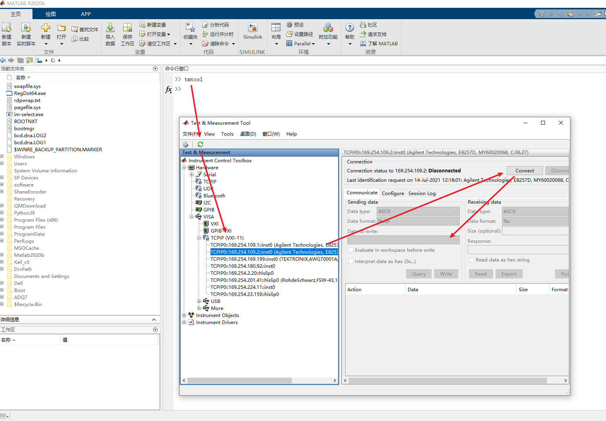

# VXI_Control_Matlab

## TODO
- [ ] 安捷伦脉冲发生器的控制代码, 其实原理类似，有空再更新
**未完待续**

# 背景
鉴于实验室目前存在的代码控制各种仪器的需求，对目前Matlab控制设备仪表的代码进行了封装和整理。

**Keysight(是德科技)**, **Aglient(安捷伦)**, **Rohde & Schwarz(罗德施瓦茨)**, **Tektronix(泰克)**,**Anritsu(安立)** 等公司的仪器均采用IVI驱动的标准编写了对应的接口，所以我们可以很容易的来控制对应的仪器。所以本代码库也只是简单的将之前我遇到过的仪器时，封装过的代码库进行整理

## 适用器件
 
| 实现文件 |   适用场景       | 参考编程手册|
|:--------:|:----------------:|:------------|
|C_EXA_N9010A|安捷伦N9010A等相同系列的频谱仪数据控制|["X-Series Signal Analyzer PSA Programming Compatibility Guide"](https://www.keysight.com/cn/zh/assets/9018-03761/programming-guides/9018-03761.pdf) && ["X-Series Signal Analyzer Programmer's Guide"](https://www.keysight.com/cn/zh/assets/9018-02192/programming-guides/9018-02192.pdf)|
|C_KeysightSignalSource|安捷伦E8257D，E8267D等相近型号仪器|["Signal Generators Programming Guide"](https://www.keysight.com/cn/zh/assets/9018-04964/programming-guides/9018-04964.pdf) && ["E8257D, E8267D, E8663D PSG Signal Generators SCPI Command Reference"](https://www.keysight.com/cn/zh/assets/9018-04965/programming-guides/9018-04965.pdf)|
|C_RS_SMW200A|罗德 SMW200A微波源控制|["R&S®SMW200A User Manual"](https://www.rohde-schwarz.com/nl/manual/r-s-smw200a-vector-signal-generator-user-manual-manuals-gb1_78701-61762.html)链接|
|C_RS_FSW43|罗德 FSW43系列频谱仪控制|["R&S®FSW user manual"](https://www.rohde-schwarz.com/hk/manual/r-s-fsw-user-manual-manuals-gb1_78701-29088.html) && 仪器自带帮助提供了串口命令|
|C_AWG70k|泰克AWG70000系列任意波形发生器(AWG70001A, AWG70002A, AWG70001B, AWG70002B)|["AWG70000 Series"](https://www.tek.com/signal-generator/awg70000-arbitrary-waveform-generator-manual/awg70000-series) && ["AWG 7000 MATLAB ICT Send Waveform 1"](https://forum.tek.com/viewtopic.php?t=133612&__cf_chl_jschl_tk__=pmd_2fde0f4f9ba6d18c1e6f8e35c9e0cfa58466f896-1627393668-0-gqNtZGzNAiKjcnBszQx6)|
|C_TektronixOscilloscope|泰克MSO70000系列示波器|["DPO70000SX, MSO/DPO70000DX, MSO/DPO70000C, DPO7000C, MSO5000/B, and DPO5000/B Series"](https://www.tek.com/oscilloscope/dpo70000-mso70000-manual/dpo70000sx-mso-dpo70000dx-mso-dpo70000c-dpo7000c-mso5000-b-1) && ["Reference Waveform File Format"](https://www.tek.com/manual/oscilloscope/reference-waveform-file-format-dpo7000-digital-phosphor-oscilloscope)|
|C_AWG14|Teledyne SP Device高速采集卡 ADQ14及ADQ12|**资料在设备商提供的驱动中**|

# 使用说明 

## 驱动安装

### 驱动下载

不同厂商都提供了对应的控制驱动，包括Keysight的IO控件，Tektronix的TekVisa等等，就目前的使用经历来看，Keysight的驱动使用最方便，由因为所有的驱动采用相同的标准，所以我们只需要安装一个合适的驱动即可

PS： Keysight的官网也是以上仪器厂商质量最高，用户手册和编程手册写的最清晰的。

我们可以在 [IO 程序库套件下载](https://www.keysight.com/cn/zh_cn/lib/software-detail/computer-software/io-libraries-suite-downloads-2175637.html)
选择需要的版本下载。

或者这个链接下载 [Keysight IO Libraries Suite 2021](https://download.keysight.com/AS/IOLibraries/windows/IOLibSuite_18_2_26526.exe?dl=1&authparam=1626859448_73f7f6aa5a51414261c157718ac2cb9f)
> 顺便可以下载Keysight对应的程序例子：[IO Libraries Suite Example Programs](https://www.keysight.com/us/en/assets/9018-21729/programming-examples/IO_Example_Programs_October_19_2016.zip)
### 添加设备
因为不同的驱动添加设备的方法不一致，所以仅提供Keysight IO控件的说明
1. 安装好IO控件后，界面如下：

2. 一般我们通过网线链接我们的设备与计算机，所以一般选择LAN，当然其他链接方式可以自行配置，使用网线链接需要注意**仪器与计算机应该在一个网段下边**


### Command Expert
这个是IO控件根据实际链接的仪器，自动搜索对应驱动，然后查找控制函数的工具，如果灵活运用，其功能非常强大：
包括：
- 搜索需要的控制控制函数，完整的帮助
- 根据对应命令，生成控制序列
- 根据生成的控制序列，导出为Matlab，C#,VB，C++等代码


### IO Monitor
这个主要配合Command Expert使用。可以监控**Command Expert**发送的串口命令或者其他仪器
 
## tmtool —— Matlab自带的仪器调试工具


tmtool 是Matlab的Test&Measure工具箱，其功能类似Keysight驱动的Command Expert工具。可以发送对应的驱动命令，获取反馈的数据，同时自动生成代码，一般适用步骤如下：
1. 命令行窗口输入tmool打开工具箱
2. 点击绿色的刷新，找到连接的设备，如果用网线连接的，一般在VISA->TCPIP内能够找到需要的设备，如图所示
3. 点击右侧的Connect连接设备
4. 在Date to Write输入框内输入要发送给仪器的命令
5. 如果要设置参数就点击**Write**，如果要查询仪器某个参数就选择**Query**
6. Matlab会自动发送命令并且获取数据
7. 测试命令正确后，然后点击**Session Log**，就会获得Matlab自动生成的代码

## 代码说明
已经提交的代码都是之前为了实现仪器控制的某些功能才做的封装为Matlab的类，并没有包含仪器控制的所有代码，理论上，根据仪器的文档，我们可以实现文档中几乎所有的控制。所以需要就根据文档自行添加就可以了。

以下简单说明下这些程序怎么使用，以 C_KeysightSignalSource.m 为例
```Matlab
% 首先创造一个连接设备的类
interface_rf = C_KeysightSignalSource('192.169.1.1'); % 连接设备
% 进行需要的设置，看代码实现本质是往仪器发送需要的命令
% function setFre(obj, fre)
%     fprintf(obj.interface, ['SOURce:FREQuency:CW ', num2str(fre)]);
% end
interface_rf.setFre(1e9); % 设置仪器的频率为1GHz
interface_rf.close(); % 不需要时断开设备
```
